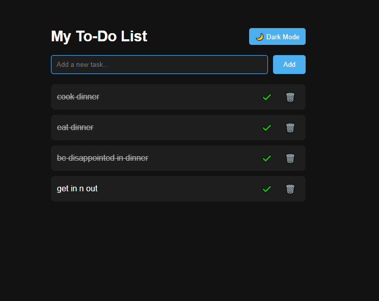

# 📝 To-Do List App

A polished to-do list web application with **Dark/Light mode toggle**.  
Tasks are saved in your browser using `localStorage`.

---

## 🚀 Features
- Add new tasks
- Mark tasks as completed
- Delete tasks
- Dark/Light mode toggle with smooth transition
- Saves tasks and theme preference automatically

---

## 🛠️ Tech Stack
- HTML5
- CSS3
- JavaScript (localStorage)

---

## ▶️ How to Run
1. Download or clone this repository:
   ```bash
   git clone https://github.com/calchang1994-port/todo-app.git
   ```
2. Open `index.html` in your browser
3. Start adding tasks ✅

---

## 📸 Preview



---

## 🔗 Live Demo & Repo
- **Live Demo:** [https://calchang1994-port.github.io/todo-app/](https://calchang1994-port.github.io/todo-app/)  
- **GitHub Repo:** [https://github.com/calchang1994-port/todo-app](https://github.com/calchang1994-port/todo-app)

---

## 📂 Project Structure
```
todo-app/
 ├── index.html
 ├── style.css
 ├── script.js
 ├── screenshot.png
 └── README.md
```
